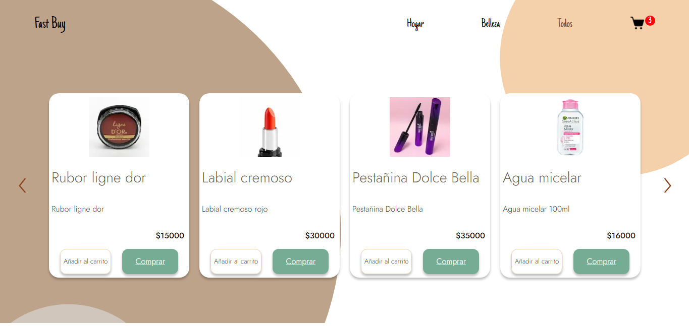
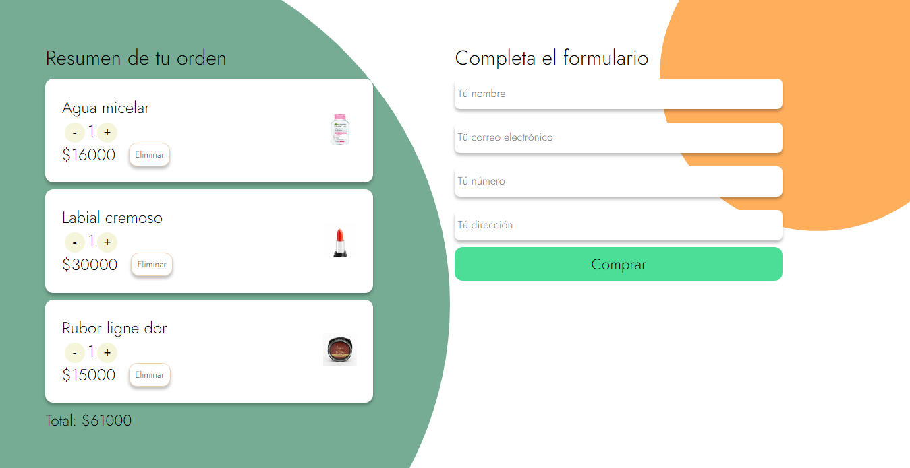

# Ecommerce fast buy
Esta prueba, hecha de forma de ecommerce, está desarrollada sobre Next js, el backend está conectado a MongoDb atlas, en donde se guardan los datos de los productos y de las ordenes realizadas. No integra pagos, se solicitan datos como el nombre, correo, celular y dirección al cliente para crear la orden con el detalle de los productos y su cantidad para posteriormente ser atendidas. Aún no implementa un panel administrativo pero sus bases están consolidadas para poder seguir con el desarrollo. La página se adapta a todos los dispositivos.

[Demo](https://ecommerce-fast.vercel.app/)
### Home

### Carrito

Credenciales para probar el modo administrador y así poder ver las ordenes en la pagina de '/cuenta'

Correo: tester@gmail.com

Contraseña: tester2321

## Pasos para hacer deploy:
1. Subir a un repositorio en github todos los archivos del proyecto (excluyendo dependencias y variables de entorno)
2. Crear una cuenta de vercel, y conectarla con la cuenta que alberga el repositorio de Github.
3. Importar el repositorio en Vercel
4. Integrar mongodb atlas con vercel desde el siguiente enlace: 
[mongdb - vercel](https://vercel.com/integrations/mongodbatlas)
este procedimiento, agrega las variables de entorno necesarias y cede permisos para 
leer y escribir a vercel.
5. De tener más variables de entorno, agregar manualmente a la hora de hacer deploy en vercel.
